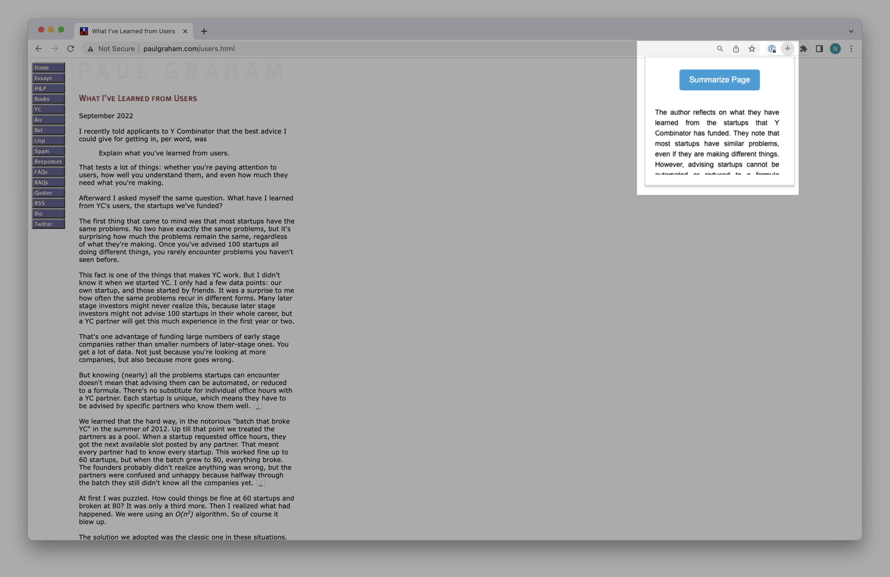

# ChatGPT Summarizer

ChatGPT Summarizer is a Chrome extension that utilizes OpenAI's ChatGPT API to automatically generate concise summaries of web page content with just one click. This easy-to-use tool helps users quickly understand the main points of a web page without having to read through the entire content.

## Features

- One-click summary generation for any web page
- Utilizes OpenAI's powerful ChatGPT API for natural language understanding
- Simple and clean user interface
- API key storage in extension options for security

## Installation

1. Clone or download this repository.
2. In Chrome, navigate to `chrome://extensions/`.
3. Enable "Developer mode" in the top right corner.
4. Click the "Load unpacked" button and select the folder containing the repository files.
5. The extension should now be installed and visible in your extensions list.

## Usage

1. Click the ChatGPT Summarizer icon in your browser's toolbar while viewing a web page.
2. The extension will display a popup with a "Summarize" button.
3. Click the "Summarize" button to generate a summary of the web page's content.
4. The summary will be displayed in the popup window.

## Options

To set your OpenAI API key:

1. Right-click the ChatGPT Summarizer icon in your browser's toolbar and select "Options."
2. Enter your OpenAI API key in the provided field and click "Save."
3. The extension will now use your API key for all requests.

## Disclaimer

This extension utilizes the OpenAI API, which is a paid service. Please review OpenAI's pricing and usage policies before using this extension. The extension developer is not responsible for any charges incurred while using the extension.

## License

MIT License. See [LICENSE](LICENSE) for more information.
